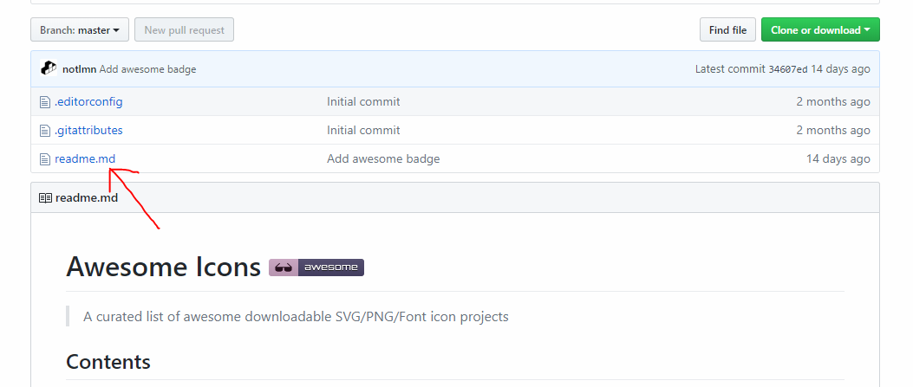
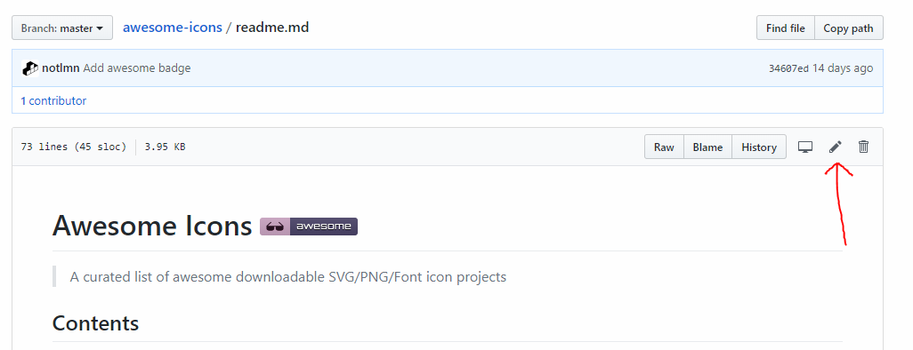
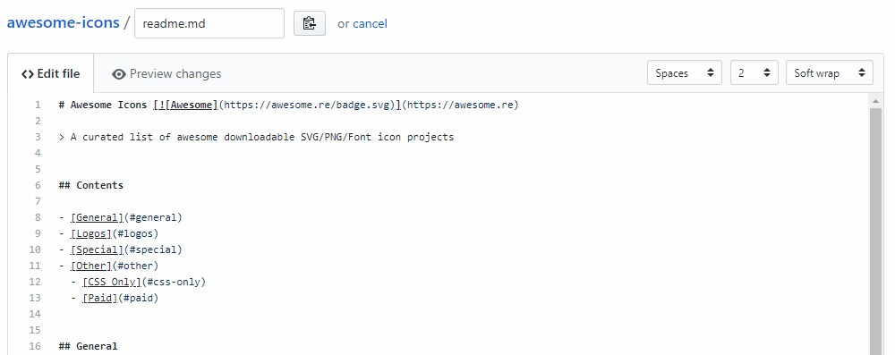
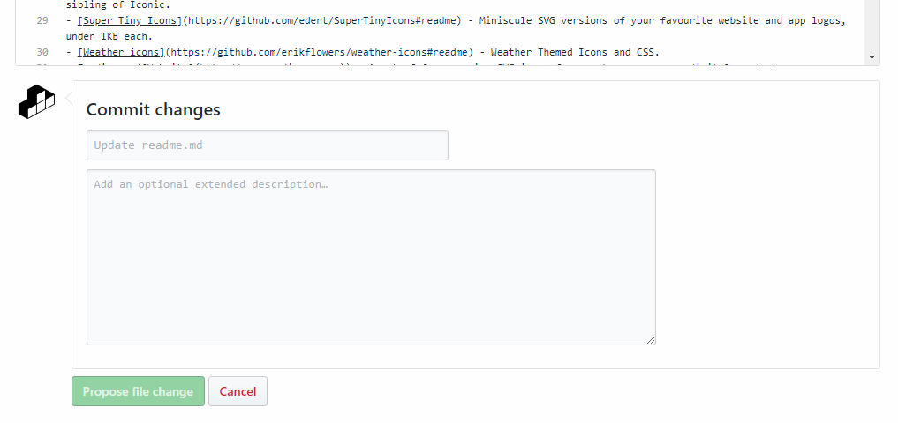

# Contribution Guidelines

Please note that this project is released with a [Contributor Code of Conduct](code-of-conduct.md). By participating in this project you agree to abide by its terms.

## Adding something to the list

1. To submit a request, you'll need a GitHub account. Don't have one, create one [here](https://github.com/join).

1. Make sure that the project that you want to submit is awesome enough.

    Something that would make you get the "aha" moment, instead of submitting every icon project on the Internet. Refer to the [awesome manifesto](https://github.com/sindresorhus/awesome/blob/master/awesome.md) for more information.

    Not sure if what you want to submit is awesome, feel free to submit a pull request anyway for discussion.

1. Click on the `readme.md` file in the GitHub repository page.

    

1. Click on the edit icon on the top right.

    

1. Add the project that you would want to in the editor, refer to [GFM](https://help.github.com/articles/github-flavored-markdown/) for help with Markdown.

    

1. Say why you're proposing the changes, and then click on "Propose file change".

    

1. Submit the [pull request](https://help.github.com/articles/using-pull-requests/)!

## Updating your Pull Request

Sometimes, a maintainer of an awesome list will ask you to edit your Pull Request before it is included. This is normally due to spelling errors or because your PR didn't match the awesome-* list guidelines.

[Here](https://github.com/RichardLitt/knowledge/blob/master/github/amending-a-commit-guide.md) is a write up on how to change a Pull Request, and the different ways you can do that.
