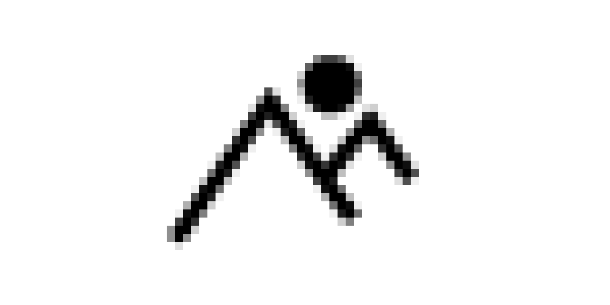

# Awesome Icons 

> A curated list of awesome downloadable SVG/PNG/Font icon projects

## Contents

- [General](#general)
- [Logos](#logos)
- [Special](#special)
- [Other](#other)
  - [CSS only](#css-only)
  - [Paid](#paid)

## General

General purpose icons used everywhere.

- [Bootstrap Icons](https://github.com/twbs/icons#readme) - SVG icons custom designed and built for Bootstrap components. ([Website](https://icons.getbootstrap.com/))
- [Boxicons](https://github.com/atisawd/boxicons#readme) - Simple vector iconset with 1000+ icons and 100+ logos. ([Website](https://boxicons.com/))
- [Byte Size Icons](https://github.com/danklammer/bytesize-icons#readme) - Tiny style-controlled SVG iconset. ([Website](https://danklammer.com/bytesize-icons))
- [Eva icons](https://github.com/akveo/eva-icons#readme) - A pack of more than 480 beautifully crafted Open Source icons. ([Website](https://akveo.github.io/eva-icons))
- [Evil icons](https://github.com/evil-icons/evil-icons#readme) - Simple and clean SVG icon pack with the code to support Rails, Sprockets, Node.js, Gulp, Grunt and CDN. ([Website](http://evil-icons.io))
- [Feather](https://github.com/feathericons/feather#readme) - Simply beautiful open source icons. ([Website](https://feathericons.com))
- Flaticon - The largest database of free vector icons. ([Website](https://flaticon.com))
- [Font Awesome](https://github.com/FortAwesome/Font-Awesome#readme) - The iconic SVG, font, and CSS toolkit. ([Website](https://fontawesome.com))
- ICONSVG - Quick customizable SVG icons, easily customize strokes, ends, and joins of paths. ([Website](https://iconsvg.xyz))
- [Ion icons](https://github.com/ionic-team/ionicons#readme) - The premium icon font for Ionic Framework and web apps everywhere. ([Website](https://ionicons.com))
- [Material design icons](https://github.com/google/material-design-icons#readme) - Material Design icons by Google. ([Website](https://material.io/tools/icons))
- [Octicons](https://github.com/primer/octicons#readme) - A scalable set of icons handcrafted with <3 by GitHub. ([Website](https://octicons.github.com))
- [Open Iconic](https://github.com/iconic/open-iconic#readme) - Open Iconic is the open source sibling of Iconic. ([Website](https://useiconic.com/open))
- [Picon](https://github.com/yne/picon#readme) - Small ligature-based icon font and SVG. ([Website](https://yne.fr/picon))
- Shape.so - Customizable, animated icons & illustrations exportable to code. ([Website](https://shape.so))
- [Super Tiny Icons](https://github.com/edent/SuperTinyIcons#readme) - Miniscule SVG versions of your favourite website and app logos, under 1KB each.
- [Tabler Icons](https://github.com/tabler/tabler-icons) - A set of over 300 free MIT-licensed high-quality SVG icons for you to use in your web projects.
- [The Noun Project](https://thenounproject.com/) - Icons for everything, Over 2 Million curated icons, created by a global community.
- [Unicons](https://github.com/iconscout/unicons) - 1000+ pixel-perfect vector icons and icon font for your next project. ([Website](https://iconscout.com/unicons))
- [VSCode Icons](https://github.com/microsoft/vscode-icons#readme) - Dark and light versions of the icons used in Visual Studio Code.
- [Weather icons](https://github.com/erikflowers/weather-icons#readme) - Weather Themed Icons and CSS.
- Zondicons - A set of free premium SVG icons for you to use on your digital products. ([Website](http://www.zondicons.com))

## Logos

Logos of different brands or companies or technologies.

- [Browser Logos](https://github.com/alrra/browser-logos#readme) - High resolution web browser logos.
- [Cryptocoins](https://github.com/AllienWorks/cryptocoins#readme) - Complete vector/webfont icon pack of your favourite cryptocurrencies.
- [Cryptocurrency icons](https://github.com/atomiclabs/cryptocurrency-icons#readme) - A set of icons for all the main cryptocurrencies and altcoins. ([Website](http://cryptoicons.co))
- [Dev icons](https://github.com/vorillaz/devicons#readme) - An iconic font made for developers. ([Website](http://vorillaz.github.io/devicons))
- [Simple icons](https://github.com/simple-icons/simple-icons#readme) - Free SVG icons for popular brands. ([Website](https://simpleicons.org))

## Special

Icons that are not general or logos, but something special.

- [Flag Kit](https://github.com/madebybowtie/FlagKit#readme) - Beautiful flag icons for usage in apps and on the web.
- [Mapsicon](https://github.com/djaiss/mapsicon#readme) - A free collection of maps for every country in the world.

## Other

### CSS only

Icons made out of CSS only (that are not downloadable).

- [cssicon](https://github.com/wentin/cssicon#readme) - Icon set made with pure css code, no dependencies, "grab and go" icons. ([Website](https://cssicon.space))
- [icono](https://github.com/saeedalipoor/icono#readme) - Pure CSS, class based icon pack. ([Website](https://saeedalipoor.github.io/icono))

### Paid

Not open-source/free, but still awesome enough.

- [Heroicons](https://www.heroicons.com) - Unique set of icons for your marketing website.
- [Iconic](https://useiconic.com) - The definitive icon set designed for the modern web.
- [Nucelo Icons](https://nucleoapp.com/premium-icons) - A premium library of SVG icons for iOS, Android & web projects.

## License

